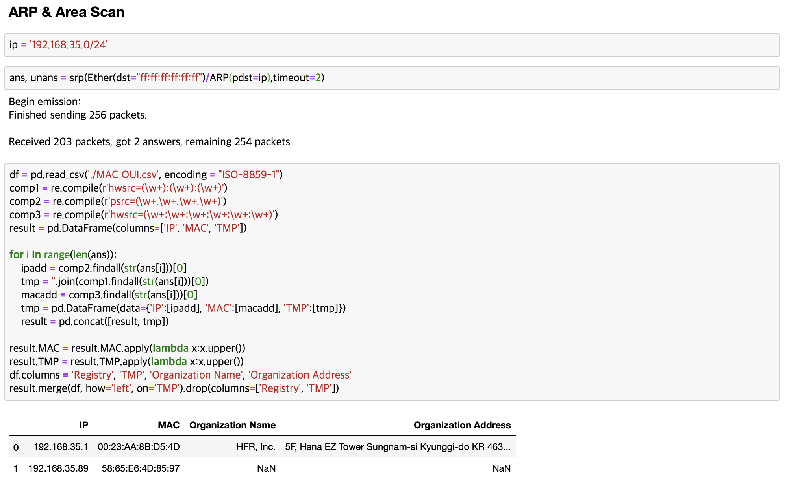

# Net-Util
Network Utility 

네트워크 유틸리티 프로그램 

## Goal
 * 기본적인 네트워크 프로토콜 제공
 * Sample Image는 기능확인용 자료
 * Sample Image/Code에서 사용한 Scapy라이브러리는 최종에서는 사용 X

### 1. Ping
 * Default Output
    * Gateway IP Address
    * Public IP Address
  
 * Input Data
    * Target IP Address
     
 * Output Data
    * Ping Result

 * Sample Image
 
 

### 2. Traceroute
 * Default Output
    * Gateway IP Address
    * Public IP Addresss
  
 * Input Data
    * Target IP Address
    
 * Output Data
    * Traceroute Result

### 3. WOL
 * Default Output
    * Gateway IP Address
    * Public IP Address
    
 * Input Data
    * Target IP Address
    * Target MAC Address
    
 * Output Data
    * WOL Result

### 4. DNS
 * Input Data
    * Service Type ( IP -> Domain / Domain -> IP )
    * IP Address / Domain Name
    
 * Output Data
    * DNS Result

 * Sample Image
 

### 5. ARP Request
 * Default Output
    * Gateway IP Address
    * Public IP Address
    
 * Input Data
    * Target IP Address
    
 * Output Data
    * Target MAC Address
    
 * Sample Image
 

### 6. Port Scan
 * Default Output
    * Gateway IP Address
    * Public IP Address
    
 * Input Data
    * Target IP Address
    * Target Port Range
    
 * Output Data
    * Port Scan Result ( Open / Closs )
    * Port Service Protocol
    
 * Sample Image
 

### 7. Whois
 * Input Data
    * IP Address / Domain Name
    
 * Output Data
    * Whois Result
    
 * Sample Image
 

